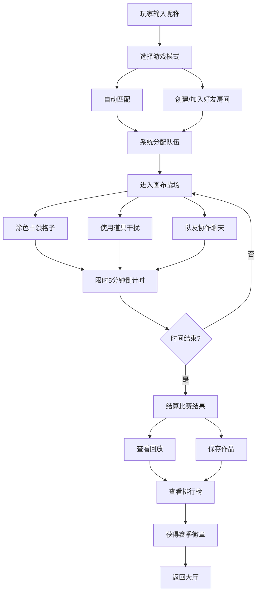

## 1. 产品概述

像素美术社群的多人对战网页小游戏，玩家在同一画布上争夺区域并完成限时涂色，融合像素艺术创作与竞技对抗。

- **核心目标**：为像素美术爱好者提供兼具创意表达和竞技乐趣的社交游戏平台，通过短局多人协作与对抗，打造独特的社群互动体验。
- **目标用户**：像素美术创作者、休闲游戏玩家、年轻社群用户，年龄覆盖13-35岁。
- **市场价值**：填补像素艺术+多人竞技的细分市场空白，通过UGC创作沉淀用户内容，构建高粘性美术社群。

---

## 2. 核心功能

### 2.1 用户角色

| 角色 | 注册方式 | 核心权限 |
|------|---------|----------|
| 普通玩家 | 昵称快速进入 | 参与游戏、使用道具、聊天互动、保存作品 |
| 房主玩家 | 创建房间 | 自定义游戏规则、邀请好友、踢出玩家 |
| 管理员 | 后台审核 | 处理举报、管理违规内容、颁发赛季徽章 |

### 2.2 功能模块

1. **登录页面**：昵称输入、随机头像、游客模式、历史记录
2. **匹配页面**：自动匹配、好友房间、房间列表、模式选择
3. **画布页面**：格子战场、涂色操作、冷却时间、格子占领、实时比分
4. **队伍页面**：队伍分配、分工设置、区域加成、战术标记
5. **道具页面**：道具商店、道具使用、干扰道具、增益道具
6. **聊天页面**：实时聊天、快捷表情、举报屏蔽、私聊功能
7. **回放页面**：赛后回放、进度控制、作品保存、分享功能
8. **排行页面**：个人排行、队伍排行、赛季徽章、成就系统

### 2.3 页面详情

| 页面名称 | 模块名称 | 功能描述 |
|---------|---------|----------|
| 登录页面 | 昵称输入 | 支持2-12字符昵称，自动检测重名，随机分配像素头像 |
| 登录页面 | 快速进入 | 游客模式一键进入，本地缓存游戏记录 |
| 匹配页面 | 自动匹配 | 根据等级智能匹配对手，30秒内快速开局 |
| 匹配页面 | 好友房间 | 创建/加入私密房间，通过房间号邀请好友 |
| 画布页面 | 格子战场 | 32×32像素画布，点击格子涂色，支持快捷键操作 |
| 画布页面 | 颜色切换 | 8种基础颜色，按数字键1-8快速切换 |
| 画布页面 | 冷却时间 | 每次涂色0.5秒冷却，被干扰道具延长冷却 |
| 画布页面 | 格子占领 | 连续涂色形成区域自动占领，显示队伍颜色边框 |
| 画布页面 | 区域加成 | 占领超过5×5区域获得涂色速度加成20% |
| 画布页面 | 任务目标 | 限时5分钟内占领最多区域或完成指定图案涂色 |
| 画布页面 | 实时比分 | 顶部显示双方/多方占领百分比和剩余时间 |
| 队伍页面 | 队伍分工 | 可选择"进攻型""防守型""支援型"分工 |
| 道具页面 | 道具系统 | 冰冻弹(冻结对手3秒)、加速符(自身速度+50%)、颜色炸弹(清除对手区域) |
| 聊天页面 | 快捷表情 | 10个预设像素表情，按F1-F10快速发送 |
| 聊天页面 | 举报屏蔽 | 一键举报违规玩家，支持屏蔽指定玩家消息 |
| 回放页面 | 赛后回放 | 完整记录对局过程，支持倍速播放、暂停、进度拖动 |
| 回放页面 | 作品保存 | 将最终画布保存为PNG图片，支持分享到社群 |
| 排行页面 | 排行榜 | 个人胜率、总涂色数、MVP次数多维度排行 |
| 排行页面 | 赛季徽章 | 每月赛季结束颁发"像素大师""战场王者"等限定徽章 |
| 全局功能 | 断线重连 | 意外掉线后60秒内可重新连接，保留游戏进度 |
| 全局功能 | 快捷键 | WASD移动视角，1-8切换颜色，空格快速涂色，Q使用道具 |

---

## 3. 核心流程

玩家输入昵称进入游戏，选择匹配模式或创建好友房间，系统自动分配队伍后进入画布战场。在5分钟限时内，玩家通过点击格子涂色占领区域，使用道具干扰对手，与队友协作完成任务目标。比赛结束后查看回放、保存作品，并在排行榜上查看成绩。

---

## 4. 用户界面设计

### 4.1 设计风格

- **主色调**：深紫(#1a0a2e)为背景，霓虹粉(#ff2d95)、电光蓝(#00d4ff)、荧光绿(#39ff14)为队伍颜色，像素风格渐变
- **按钮风格**：8-bit像素边框按钮，悬浮时有像素抖动动画，点击有 CRT 扫描线效果
- **字体**：标题使用 `Press Start 2P` 像素字体，正文使用 `VT323` 等宽像素字体
- **布局风格**：暗黑赛博朋克风格，网格背景，像素粒子特效，CRT显示器扫描线叠加
- **图标风格**：纯像素绘制图标，16×16和32×32两种尺寸，霓虹发光效果

### 4.2 页面设计概述

| 页面名称 | 模块名称 | UI元素 |
|---------|---------|--------|
| 登录页面 | 昵称输入 | 像素风格输入框，随机像素头像预览，扫描线动画背景 |
| 登录页面 | 快速进入 | 大号像素按钮，悬浮时霓虹闪烁效果 |
| 匹配页面 | 房间列表 | 卡片式布局，每个房间显示像素缩略图、人数、模式 |
| 匹配页面 | 匹配动画 | 像素加载动画，匹配成功时像素粒子爆炸效果 |
| 画布页面 | 战场区域 | 居中32×32像素网格，悬浮格子高亮，涂色时有粒子迸溅 |
| 画布页面 | 比分面板 | 顶部固定，左右两队进度条，中间倒计时，霓虹发光边框 |
| 画布页面 | 颜色选择器 | 底部8个颜色方块，选中时有放大发光效果 |
| 画布页面 | 道具栏 | 右下角3个道具槽，冷却时像素遮罩动画 |
| 队伍页面 | 队员列表 | 头像+分工标签，在线状态像素指示灯 |
| 聊天页面 | 消息列表 | 像素气泡，不同队伍颜色区分，表情为16×16像素图 |
| 回放页面 | 控制栏 | 像素风格播放控件，进度条可拖动，倍速按钮 |
| 排行页面 | 排行榜 | 前三名像素奖杯，排名列表带像素头像和徽章 |

### 4.3 响应式设计

- **桌面优先**：主画布区域保持固定比例，侧边栏自适应宽度
- **平板适配**：768px以上保持完整布局，按钮最小尺寸48px
- **触屏优化**：格子点击区域扩大，支持双指缩放画布，虚拟快捷键面板
- **移动端**：480px以下简化布局，优先保证画布操作区域

### 4.4 动效设计

- **页面切换**：像素化转场，从左到右扫描式切换
- **格子涂色**：颜色填充动画+像素粒子向外迸溅
- **区域占领**：边界闪光+队伍颜色渐入，数字跳动显示加成
- **道具使用**：全屏像素闪光特效，目标区域像素抖动
- **比分变化**：数字翻转动画，领先方霓虹脉冲效果
- **聊天消息**：消息滑入动画，@时有像素闪烁提醒
