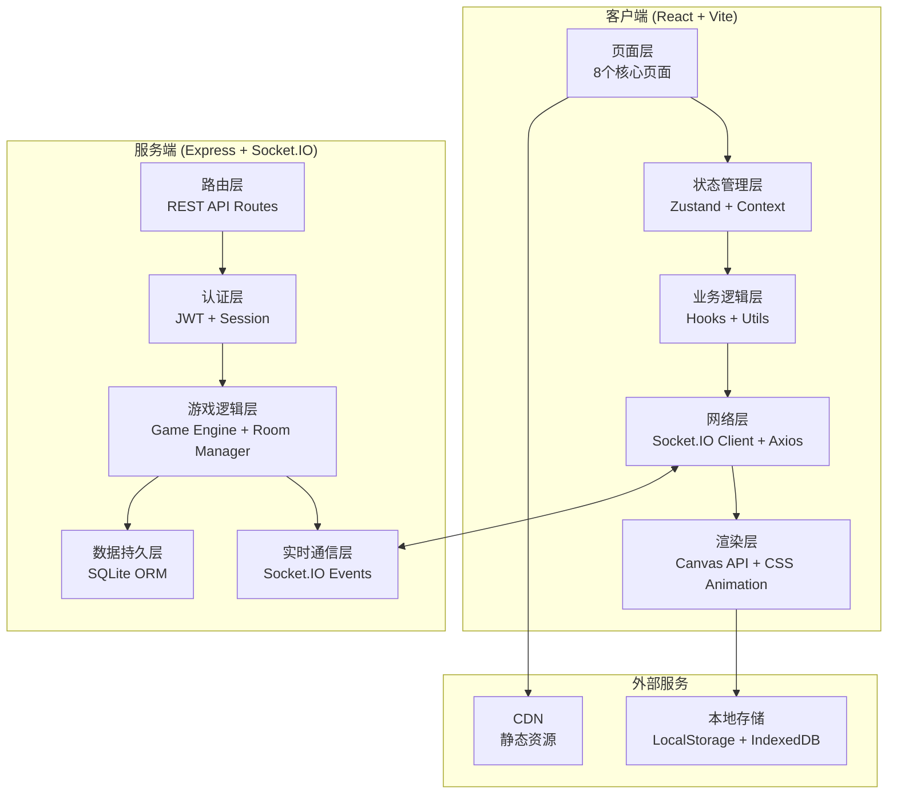
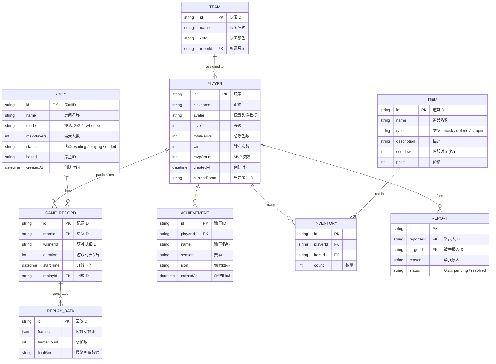
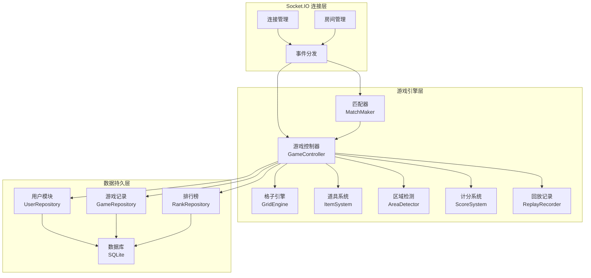

## 1. 架构设计



---

## 2. 技术选型

### 2.1 前端技术栈

| 技术 | 版本 | 用途 |
|------|------|------|
| React | 18.2.0 | UI框架，函数组件+Hooks |
| TypeScript | 5.3.0 | 类型安全，提升开发体验 |
| Vite | 5.0.0 | 构建工具，快速热更新 |
| TailwindCSS | 3.4.0 | 原子化CSS，快速构建UI |
| Zustand | 4.4.0 | 轻量级状态管理 |
| Socket.IO Client | 4.7.0 | 实时通信 |
| Canvas API | - | 像素画布渲染 |
| Framer Motion | 10.16.0 | 动画效果（像素风格） |
| React Router | 6.20.0 | 路由管理 |

### 2.2 后端技术栈

| 技术 | 版本 | 用途 |
|------|------|------|
| Express | 4.18.0 | Web框架 |
| TypeScript | 5.3.0 | 类型安全 |
| Socket.IO | 4.7.0 | WebSocket实时通信 |
| better-sqlite3 | 9.2.0 | 轻量级数据库 |
| JWT | 9.0.0 | 用户认证 |
| uuid | 9.0.0 | 唯一ID生成 |

### 2.3 初始化工具

- **前端**：`npm create vite@latest client -- --template react-ts`
- **后端**：`npm init -y && npm install express typescript socket.io better-sqlite3 @types/node @types/express`

---

## 3. 路由定义

### 3.1 前端路由 (React Router)

| 路由路径 | 页面名称 | 说明 |
|---------|---------|------|
| `/` | 登录页面 | 昵称输入、快速进入 |
| `/match` | 匹配页面 | 自动匹配、好友房间列表 |
| `/game` | 画布页面 | 核心游戏战场 |
| `/team` | 队伍页面 | 队伍管理、分工设置 |
| `/items` | 道具页面 | 道具商店、背包 |
| `/chat` | 聊天页面 | 全局/房间聊天 |
| `/replay/:gameId` | 回放页面 | 比赛回放、作品保存 |
| `/rank` | 排行页面 | 排行榜、赛季徽章 |

### 3.2 后端API路由 (REST)

| 路由 | 方法 | 用途 |
|-----|------|------|
| `/api/auth/guest` | POST | 游客登录，返回token |
| `/api/user/profile` | GET | 获取用户信息 |
| `/api/user/profile` | PUT | 更新用户昵称/头像 |
| `/api/rooms` | GET | 获取房间列表 |
| `/api/rooms` | POST | 创建房间 |
| `/api/rooms/:id/join` | POST | 加入房间 |
| `/api/rooms/:id/leave` | POST | 离开房间 |
| `/api/game/:id/replay` | GET | 获取回放数据 |
| `/api/rankings` | GET | 获取排行榜 |
| `/api/user/achievements` | GET | 获取用户徽章 |
| `/api/report` | POST | 举报玩家 |

### 3.3 Socket.IO 事件

| 事件名 | 方向 | 数据结构 | 说明 |
|-------|------|---------|------|
| `match:find` | Client→Server | `{ mode: 'auto' \| 'friend' }` | 请求匹配 |
| `match:found` | Server→Client | `{ roomId, teams }` | 匹配成功 |
| `match:cancel` | Client→Server | - | 取消匹配 |
| `game:start` | Server→Client | `{ startTime, duration, gridSize }` | 游戏开始 |
| `cell:paint` | Client→Server | `{ x, y, color, teamId }` | 涂色请求 |
| `cell:update` | Server→Client | `{ x, y, color, teamId, playerId }` | 格子更新广播 |
| `area:capture` | Server→Client | `{ area, teamId, bonus }` | 区域占领广播 |
| `item:use` | Client→Server | `{ itemId, targetId? }` | 使用道具 |
| `item:effect` | Server→Client | `{ itemId, effect, targetId }` | 道具效果广播 |
| `chat:send` | Client→Server | `{ message, type, roomId }` | 发送聊天 |
| `chat:receive` | Server→Client | `{ playerId, message, type, timestamp }` | 接收聊天 |
| `score:update` | Server→Client | `{ teams: [{id, score, percent}], timeLeft }` | 比分更新 |
| `game:end` | Server→Client | `{ winner, scores, replayId }` | 游戏结束 |
| `player:disconnect` | Server→Client | `{ playerId }` | 玩家断线 |
| `player:reconnect` | Client→Server | `{ gameId, playerId }` | 断线重连 |

---

## 4. 数据模型

### 4.1 数据模型定义 (ER图)



### 4.2 核心数据结构 (TypeScript)

```typescript
// 玩家信息
interface Player {
  id: string;
  nickname: string;
  avatar: string; // base64 8x8像素头像
  teamId: string | null;
  role: 'attacker' | 'defender' | 'supporter';
  isOnline: boolean;
  stats: {
    paints: number;
    areasCaptured: number;
    itemsUsed: number;
  };
}

// 格子数据
interface Cell {
  x: number;
  y: number;
  color: string | null;
  teamId: string | null;
  painterId: string | null;
  lastPainted: number; // timestamp
}

// 游戏状态
interface GameState {
  id: string;
  status: 'waiting' | 'playing' | 'ended';
  gridSize: number; // 32
  grid: Cell[][];
  teams: Team[];
  players: Player[];
  startTime: number;
  duration: number; // 300秒 (5分钟)
  timeLeft: number;
  scores: { [teamId: string]: number };
  capturedAreas: Area[];
  replayFrames: ReplayFrame[];
}

// 区域数据
interface Area {
  id: string;
  teamId: string;
  cells: { x: number; y: number }[];
  bonus: number; // 加成百分比
  createdAt: number;
}

// 道具
interface Item {
  id: string;
  name: string;
  type: 'attack' | 'defend' | 'support';
  icon: string; // 像素图标
  cooldown: number;
  lastUsed: number;
  count: number;
  effect: {
    freeze?: number; // 冻结秒数
    speedBoost?: number; // 速度加成
    clearArea?: boolean; // 清除区域
    shield?: number; // 护盾秒数
  };
}

// 聊天消息
interface ChatMessage {
  id: string;
  playerId: string;
  nickname: string;
  content: string;
  type: 'text' | 'emote' | 'system';
  timestamp: number;
  teamId?: string; // 队伍消息
}

// 回放帧
interface ReplayFrame {
  timestamp: number;
  type: 'paint' | 'area' | 'item' | 'score' | 'chat';
  data: any;
}
```

---

## 5. 服务器架构



### 5.1 核心模块说明

1. **MatchMaker (匹配器)**
   - 按等级/胜率智能匹配
   - 30秒超时自动补位AI
   - 支持自定义房间密码

2. **GridEngine (格子引擎)**
   - 32×32网格状态管理
   - 涂色冷却控制 (默认0.5秒)
   - 颜色冲突检测
   - 区域连通性算法 (BFS)

3. **AreaDetector (区域检测)**
   - 实时检测4连通区域
   - 区域大小计算 (≥5×5触发加成)
   - 区域边界渲染优化

4. **ItemSystem (道具系统)**
   - 道具效果实现：冰冻、加速、清屏、护盾
   - 冷却时间管理
   - 目标选择验证

5. **ReplayRecorder (回放记录)**
   - 帧录制 (10fps)
   - 增量压缩存储
   - 回放Seek支持

### 5.2 DDL 语句 (SQLite)

```sql
-- 玩家表
CREATE TABLE players (
  id TEXT PRIMARY KEY,
  nickname TEXT NOT NULL,
  avatar TEXT,
  level INTEGER DEFAULT 1,
  total_paints INTEGER DEFAULT 0,
  wins INTEGER DEFAULT 0,
  losses INTEGER DEFAULT 0,
  mvp_count INTEGER DEFAULT 0,
  created_at DATETIME DEFAULT CURRENT_TIMESTAMP,
  last_login_at DATETIME DEFAULT CURRENT_TIMESTAMP
);

-- 游戏记录表
CREATE TABLE game_records (
  id TEXT PRIMARY KEY,
  room_id TEXT NOT NULL,
  mode TEXT NOT NULL,
  winner_team_id TEXT,
  duration INTEGER NOT NULL,
  start_time DATETIME NOT NULL,
  replay_id TEXT,
  final_grid BLOB
);

-- 玩家游戏统计表
CREATE TABLE player_game_stats (
  id TEXT PRIMARY KEY,
  game_id TEXT NOT NULL,
  player_id TEXT NOT NULL,
  team_id TEXT NOT NULL,
  paints INTEGER DEFAULT 0,
  areas_captured INTEGER DEFAULT 0,
  items_used INTEGER DEFAULT 0,
  is_mvp INTEGER DEFAULT 0,
  FOREIGN KEY (game_id) REFERENCES game_records(id),
  FOREIGN KEY (player_id) REFERENCES players(id)
);

-- 徽章表
CREATE TABLE achievements (
  id TEXT PRIMARY KEY,
  player_id TEXT NOT NULL,
  name TEXT NOT NULL,
  season TEXT NOT NULL,
  icon TEXT,
  description TEXT,
  earned_at DATETIME DEFAULT CURRENT_TIMESTAMP,
  FOREIGN KEY (player_id) REFERENCES players(id)
);

-- 道具库存表
CREATE TABLE inventories (
  id TEXT PRIMARY KEY,
  player_id TEXT NOT NULL,
  item_id TEXT NOT NULL,
  count INTEGER DEFAULT 0,
  FOREIGN KEY (player_id) REFERENCES players(id)
);

-- 举报表
CREATE TABLE reports (
  id TEXT PRIMARY KEY,
  reporter_id TEXT NOT NULL,
  target_id TEXT NOT NULL,
  game_id TEXT,
  reason TEXT NOT NULL,
  status TEXT DEFAULT 'pending',
  created_at DATETIME DEFAULT CURRENT_TIMESTAMP,
  FOREIGN KEY (reporter_id) REFERENCES players(id),
  FOREIGN KEY (target_id) REFERENCES players(id)
);

-- 屏蔽列表
CREATE TABLE blocked_players (
  id TEXT PRIMARY KEY,
  player_id TEXT NOT NULL,
  blocked_player_id TEXT NOT NULL,
  created_at DATETIME DEFAULT CURRENT_TIMESTAMP,
  UNIQUE(player_id, blocked_player_id)
);

-- 创建索引
CREATE INDEX idx_players_nickname ON players(nickname);
CREATE INDEX idx_game_records_start_time ON game_records(start_time);
CREATE INDEX idx_player_game_stats_player ON player_game_stats(player_id);
CREATE INDEX idx_achievements_player ON achievements(player_id);
```

### 5.3 初始数据

```sql
-- 初始道具
INSERT INTO inventories (id, player_id, item_id, count) VALUES
('item_freeze', '冰冻弹', 'attack', '冻结目标玩家3秒', 3000, 10),
('item_speed', '加速符', 'support', '自身涂色速度+50%，持续10秒', 5000, 15),
('item_bomb', '颜色炸弹', 'attack', '清除5×5区域内敌方颜色', 8000, 20),
('item_shield', '防护盾', 'defend', '5秒内免疫干扰效果', 6000, 15),
('item_reveal', '侦查眼', 'support', '显示对手10秒内涂色轨迹', 4000, 12);

-- 初始徽章模板
INSERT INTO achievements (id, player_id, name, season, icon, description) VALUES
('badge_pixel_master', '', '像素大师', '', '🏆', '单局涂色超过200格'),
('badge_king', '', '战场王者', '', '👑', '赛季排行榜第一'),
('badge_team_player', '', '团队支柱', '', '🤝', '助攻队友占领10个区域'),
('badge_survivor', '', '绝境逆转', '', '🔥', '落后30%以上反超获胜');
```
